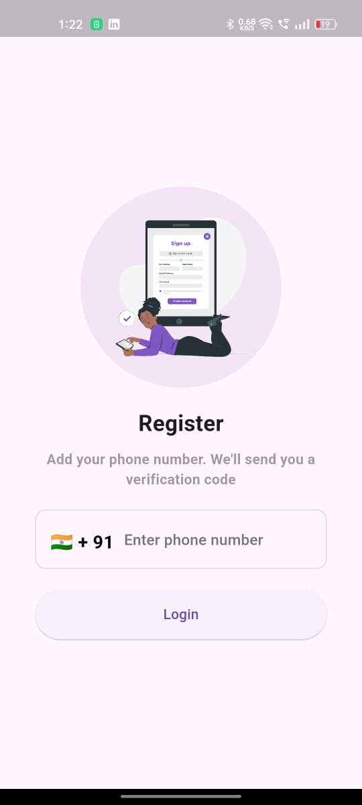
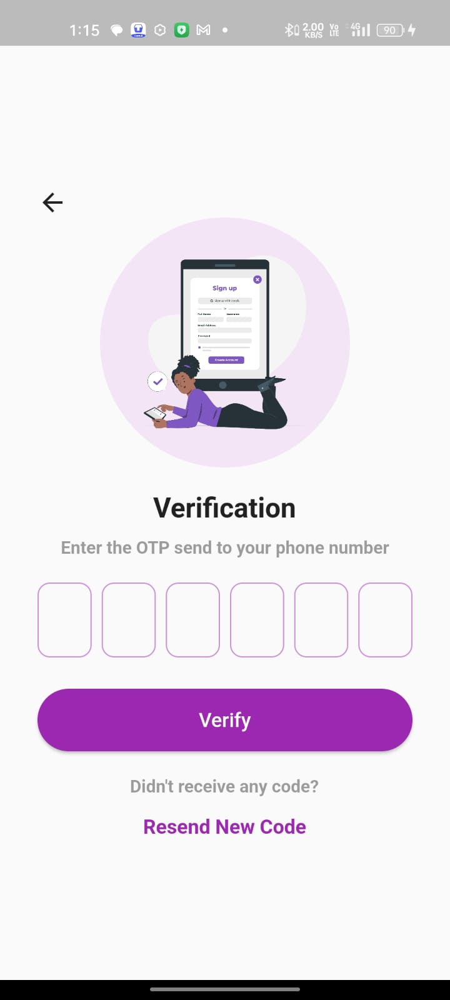
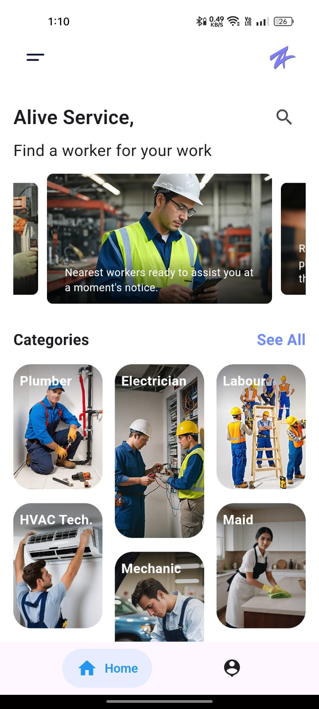
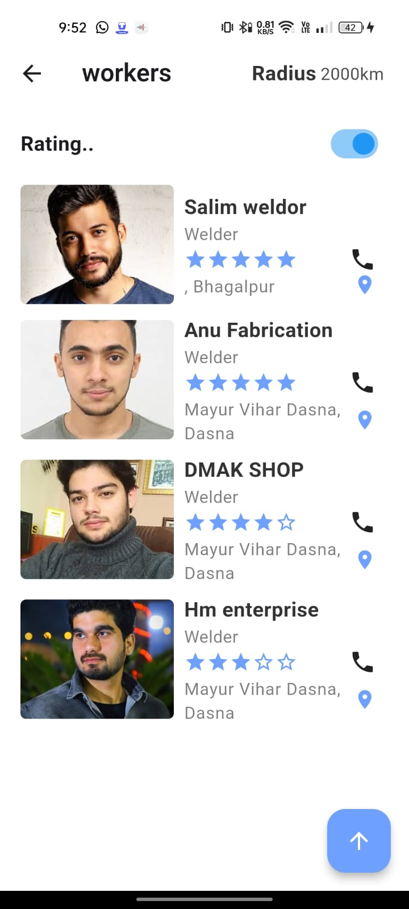
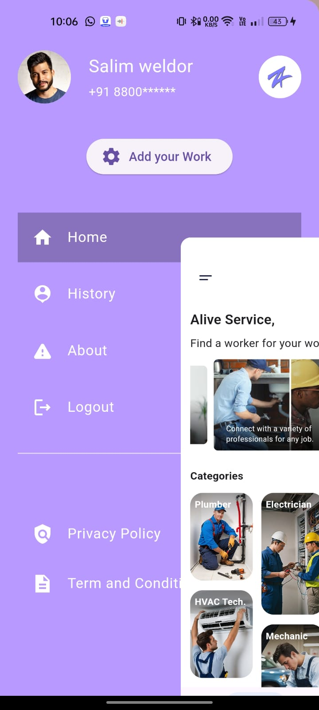
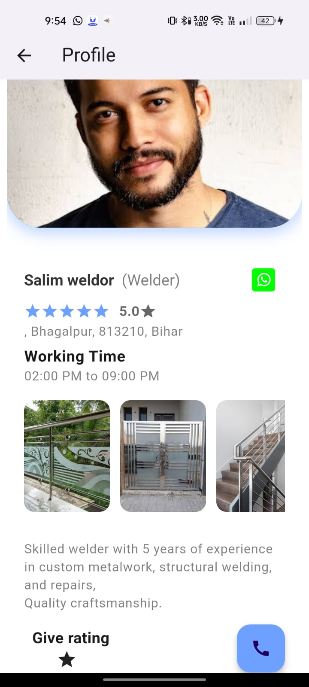

# Alive Service App

A Flutter project connecting users with various service workers, enabling calls, messages, and ratings. This app demonstrates Flutter development with Firebase, Riverpod, and real-world app features.

---

## Getting Started

This project is a starting point for a Flutter application.  

A few resources to help you if you are new to Flutter:

- [Lab: Write your first Flutter app](https://docs.flutter.dev/get-started/codelab)
- [Cookbook: Useful Flutter samples](https://docs.flutter.dev/cookbook)
- [Flutter Documentation](https://docs.flutter.dev/)

---

## Screenshots

Here are some screenshots of the app:

---

## Features

- User authentication via phone number
- Call, message, and rate service workers
- Profile management and geolocation
- Chat and status update functionality
- History tracking of interactions

---

## Notes

- Make sure you have Flutter installed.  
- Run `flutter pub get` to install dependencies before running the app.
